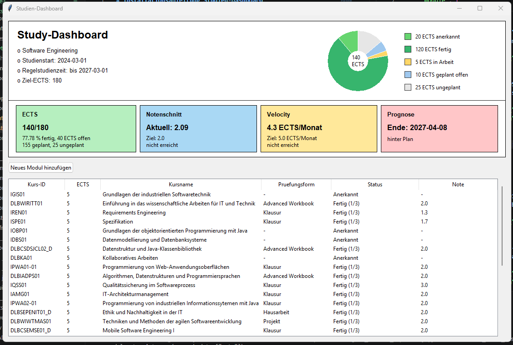

# Installationsanleitung Studien-Dashboard

## Projekt herunterladen

```powershell
git clone https://github.com/Delis267/study-dashboard.git
cd study-dashboard
```

## Anwendung starten

Die fertige Anwendung befindet sich im Ordner `Phase3`. Zum Starten bitte folgende Befehle ausführen:

```powershell
cd Phase3
python run_application.py
```

Alternative über das Bootstrap-Modul (Composition-Root)
```powershell
cd Phase3/src
python -m bootstrap.main
```


Danach öffnet sich die Tkinter-Oberfläche des Studien-Dashboards. Die Anwendung lädt die Beispieldaten aus:
```text
Phase3\src\data\studium.json
```
Die Oberfläche sieht wie folgt aus:


In der Oberfläche können Module angezeigt, hinzugefügt, bearbeitet und gelöscht werden. Studiumsgrunddaten müssen in der JSON-Datei manuell verändert werden. Funktionierende Testdaten sind allerdings bereits anlegt.

## Tests ausführen

Die Tests für Phase 3 können ebenfalls aus dem Ordner `Phase3` gestartet werden:

```powershell
python run_tests.py
```

## Hinweise zur Bedienung

- Die Anwendung untersützt keinen Darkmode
- Ein neues Modul wird über die Schaltfläche `Neues Modul hinzufügen` angelegt.
- Ein vorhandenes Modul kann per Doppelklick in der Tabelle bearbeitet oder gelöscht werden.
- Die Modultabelle lässt sich mit Klick auf den Tabellenkopf sortieren.

## Hinweise zur Projektstruktur

Jede Projektphase besitzt ein eigenes Hauptverzeichnis: `Phase1`, `Phase2` und `Phase3` und darin eine eigene Readme.

Die Verzeichnisse sind ähnlich aufgebaut:

- Im Ordner `docs` befinden sich Dokumentationsartefakte wie UML-Diagramme, Wireframes und Berichte.
- Im Ordner `src` befindet sich der jeweilige Python-Quellcode.
- In Phase 3 liegen die automatisierten Tests im Ordner `tests`.

Damit das Starten und Testen einfach bleibt, enthält Phase 3 zwei Einstiegsskripte:

- `run_application.py` startet den Dashboard-Prototyp.
- `run_tests.py` führt die automatisierten Tests aus.

## Getestete Umgebung

Die Anleitung ist für ein aktuelles Windows-Betriebssystem ausgelegt. Getestet wurde der Start über PowerShell mit Python 3.
